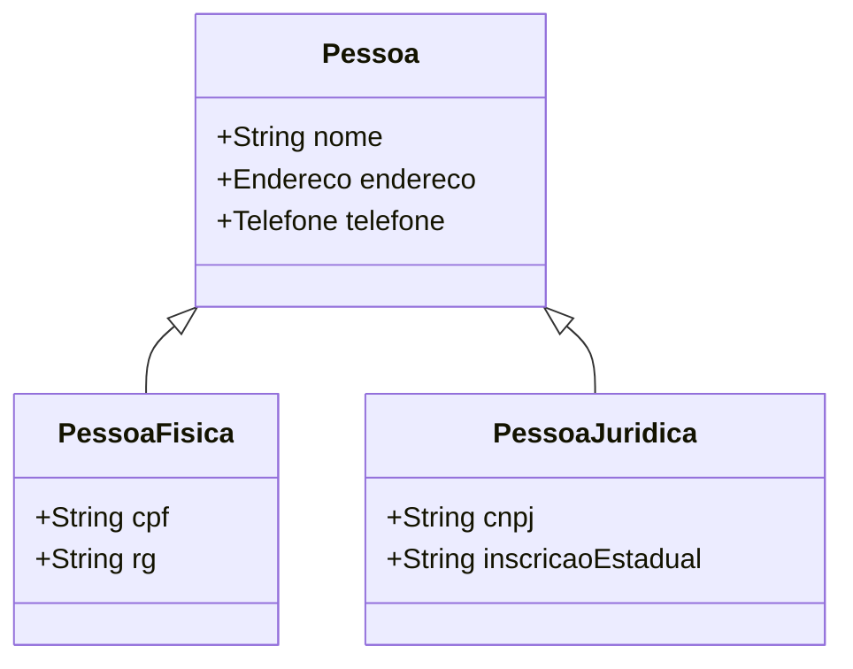

<div align="center">

# 🏛️ Sistema de Gestão Profissional — Objetos em JavaScript


**🏆 A solução definitiva em Programação Orientada a Objetos desenvolvida para o programa Bolsa Futuro Digital.**

</div>

---

## 📘 Sobre o Projeto

Este repositório contém a **versão final e otimizada** de um sistema de gestão robusto. Diferente das versões iniciais de estudo, este projeto foi construído para seguir os padrões profissionais do mercado, garantindo que o código seja fácil de manter e expandir.

O sistema resolve o problema de organização de dados complexos para escolas e empresas, separando totalmente a lógica de funcionamento do armazenamento das informações.

---


## 📊 Modelagem do Sistema

A estrutura foi planejada para garantir que todos os elementos se conectem de forma lógica. Abaixo, a representação visual dessa hierarquia:



---

## ✨ Conceitos Dominados

* **Arquitetura de Software Orientada a Objetos** Domínio completo na modelagem de entidades complexas e objetos de negócio. O foco é transformar regras do mundo real em estruturas de código robustas, garantindo que o sistema seja fácil de entender e escalar.

* **Engenharia de Herança e Reuso de Código** Aplicação estratégica de herança para criar hierarquias lógicas entre classes. Isso permite o reaproveitamento máximo de funções e propriedades, reduzindo drasticamente a duplicidade e facilitando a manutenção do projeto.

* **Modularização e Encapsulamento (ES Modules)** Estruturação avançada do projeto utilizando módulos nativos para isolar responsabilidades. Cada componente funciona de forma independente, o que melhora a segurança do código e permite que diferentes partes do sistema sejam atualizadas sem impactos negativos.

* **Design Pattern DAO (Data Access Object)** Implementação de padrões de projeto de nível profissional para gerenciar o fluxo de informações. Essa camada separa totalmente a lógica das regras de negócio do armazenamento físico, tornando o sistema muito mais flexível a mudanças tecnológicas.

* **Gestão e Persistência de Dados Estruturados** Capacidade técnica para manipular fluxos de dados complexos via JSON. O foco está na integridade da informação e na simulação eficiente de ambientes de banco de dados, garantindo que o estado da aplicação seja preservado corretamente.

* **Modelagem Técnica e Documentação UML** Planejamento visual de sistemas através de diagramas de classe. Essa habilidade permite antecipar gargalos estruturais e documentar a arquitetura técnica, servindo como um guia preciso para o desenvolvimento e futuras manutenções.


---


## ⭐ Diferenciais desta Versão Definitiva

Para atingir o nível profissional, apliquei os seguintes pilares fundamentais:

* ✅ **Padronização Profissional**: Código escrito seguindo as regras mais modernas do JavaScript atual (ES6+).
* ✅ **Arquitetura em Camadas**: Separação clara entre o que é dado (Model) e o que é funcionalidade (DAO).
* ✅ **Robustez**: Tratamento seguro de informações com formato JSON e armazenamento persistente.
* ✅ **Escalabilidade**: Estrutura preparada para crescer e receber novos recursos sem a necessidade de reescrever o código base.

---

## 🛠️ Especificações Técnicas

Nesta seção, detalho as tecnologias e ferramentas utilizadas para garantir a eficiência e a modernidade do sistema:

* ● **Ambiente de Execução**
  Utilização do **Node.js (versão 18 ou superior)**, assegurando um ambiente de alta performance para a execução de módulos e scripts do sistema.

* ● **Linguagem de Programação**
  Desenvolvimento em **JavaScript Moderno (ES6+)**, explorando recursos avançados como arrow functions, classes, módulos nativos e gestão de escopo.

* ● **Persistência de Dados**
  Implementação de **armazenamento local**, simulando o comportamento de bancos de dados modernos para garantir que as informações sejam salvas e recuperadas corretamente.

* ● **Modelagem de Sistemas**
  Criação de arquitetura visual através de **diagramas de classe**, facilitando a compreensão técnica e a manutenção futura do software.

---

## 🗂️ Estrutura do Projeto

```
BFD_JS_OO-main/
│
├── arrays.js # Manipulação de arrays
├── declvar.js # Declaração de variáveis (var, let, const)
├── funcbasic.js # Funções básicas
├── lacos.js # Estruturas de repetição
├── lacosarray.js # Laços aplicados a arrays
├── tipovar.js # Tipos de variáveis
├── usamodulo.js # Exemplo de uso de módulos JS
│
├── biblioteca/
│ └── definemodulo.js # Criação de módulo personalizado
│
├── objetos/
│ ├── Pessoa.js # Classe base de Pessoa
│ ├── usaPessoa.js # Exemplo de instanciação e uso da classe Pessoa
│ ├── usaPF.js # Testes com Pessoa Física (PF)
│ ├── usaPJDAO.mjs # Demonstração de DAO com Pessoa Jurídica (PJ)
│ ├── escola/
│ │ ├── Aluno.js
│ │ └── AlunoBase.js
│ └── pessoas/
│ ├── Aluno.js
│ ├── Endereco.js
│ ├── PF.js
│ ├── PJ.js
│ ├── Pessoa.js
│ ├── Telefone.js
│ ├── Titulo.js
│ ├── DAOs/
│ │ ├── PJDAO.mjs
│ │ └── localStorage.mjs
│ ├── ENDERECO/
│ │ ├── Endereco.mjs
│ │ └── usaEndereco.mjs
│ └── IE/
│ ├── IE.mjs
│ ├── IEclss.js
│ ├── IEfunc.js
│ ├── IEjson.js
│ └── usaIE.mjs
│
├── plantUML/
│ └── uml1.txt # Diagrama UML dos relacionamentos
│
└── package.json # Dependências do projeto
```

---

## 🎓 Competências e Soluções Aplicadas

Neste projeto definitivo, a teoria foi transformada em soluções reais para problemas de engenharia de software, consolidando os seguintes pilares:

* ✅ **Lógica Avançada**: Resolução de problemas complexos através de algoritmos estruturados e eficientes.
* ✅ **Engenharia de Objetos**: Domínio completo sobre a criação de sistemas modulares e reutilizáveis.
* ✅ **Gerenciamento de Dados**: Implementação de fluxos de leitura e escrita de dados de forma organizada.
* ✅ **Arquitetura de Software**: Planejamento prévio do sistema através de documentação técnica e diagramas.
* ✅ **Visão de Mercado**: Desenvolvimento focado em criar um código que outros programadores consigam ler e manter.

Este projeto representa a transição do aprendizado teórico para a entrega de um sistema funcional, conectando as melhores práticas de desenvolvimento à construção de aplicações web modernas.


